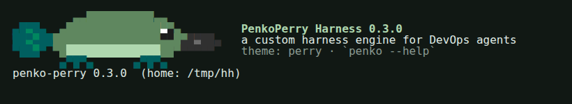
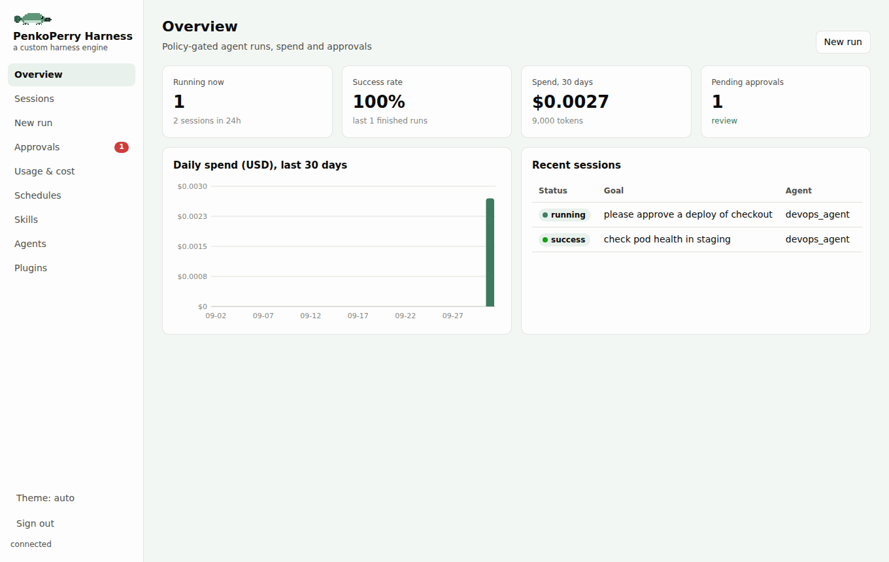

<p align="center"></p>

<p align="center"><b>PenkoPerry Harness is a custom harness engine: policy-gated agents for DevOps that turn goals into <i>verified</i> outcomes, and can prove what they did.</b></p>

<p align="center"><code>penko chat</code> · <code>penko run</code> · <code>penko serve</code> · <code>penko dashboard</code></p>

PenkoPerry Harness is a custom harness engine. Most agent frameworks optimise what an agent *can do*; PenkoPerry Harness optimises whether the agent
*actually accomplished the goal* - safely, observably, and with a tamper-evident record - while staying
small and fast. DevOps/SRE (Kubernetes, ArgoCD, GitOps) is the first domain pack; the core is domain-neutral.

```text
GOAL → CONTEXT → AGENT → POLICY → APPROVAL → EXECUTE → VERIFY → RECEIPT → LEARN → MEMORY
```

## Get started

```bash
curl -fsSL https://raw.githubusercontent.com/aniketpitre/PenkoPerry-Harness/main/install.sh | sh
penko init                 # pick a provider and model, paste a key (or point at LM Studio / Ollama / your own server)
penko doctor --online      # checks everything and makes one tiny model call
penko chat                 # talk to the agent in your terminal; approvals appear inline
```

Then, when you want more:

```bash
penko run "Summarise failing pods in staging" --mode read-only   # one-shot, prints a receipt
penko serve                # API + web dashboard on http://127.0.0.1:8000/ui
penko dashboard            # open the dashboard, already signed in
penko cost                 # what you have spent, by model
```

Using a different model provider, or your own model server? See [Connect a model provider](#connect-a-model-provider).

- [Why PenkoPerry Harness](#why-penko-perry)
- [Feature overview](#feature-overview)
- [Architecture](#architecture)
- [How a run works](#how-a-run-works)
- [Safety model](#safety-model)
- [The event log](#the-event-log-source-of-truth)
- [Context, memory and skills](#context-memory-and-skills)
- [Plugins and extensibility](#plugins-and-extensibility)
- [Comparison with other agents](#how-it-compares)
- [Get started](#get-started) · [Connect a model provider](#connect-a-model-provider) · [Install and commands](#install-and-commands) · [Configuration](#configuration) · [API](#api) · [Docker](#docker)
- [Testing](#testing) · [Project layout](#project-layout) · [Limitations](#known-limitations) · [Docs](#documentation)

---

## Why PenkoPerry Harness

The design goal is to keep the strengths of the well-known agents while fixing the things they leave to the
user. Each point below is something the code enforces and the test suite checks - not a roadmap item.

1. **Safety is structural, not a prompt.** Every tool - built-in, MCP, or written by the agent itself - goes
   through *one* `invoke()` path: capability check, argument validation, hooks, policy, approval, execution,
   output limiting, verification, receipt. There is no side door, so a new tool cannot forget to be safe.
2. **Risk depends on the arguments, not just the tool name.** Restarting a pod in `kube-system` is denied
   *before* any API call; syncing an ArgoCD app is R3 unless the app is explicitly listed as staging;
   `git push --force origin main` is blocked while `git status` runs freely.
3. **Approvals mean something.** They are bound to the SHA-256 of the exact arguments, restricted to an
   approver allowlist, scoped (once / session / always - never "always" for R3), and **an unanswered approval is a
   denial**, not a hang. The model is told why and adapts.
4. **"Done" is verified, not claimed.** A run is `success` only if it completed *and* its verification passed
   (file, HTTP probe, command, Kubernetes rollout, ArgoCD health, or an independent read-only verifier agent).
5. **Everything is an append-only, hash-chained event log.** Transcripts, receipts, streaming, resume, fork
   and search are projections of one table. Tampering is detectable; with an HMAC key it is unforgeable.
6. **Untrusted content is tracked.** Web pages, logs and MCP output are wrapped, sanitised, and *taint* the run:
   after untrusted content enters the context, mutating actions are raised one risk tier.
7. **Fast and light.** Streaming, parallel read-only tools, worker threads for blocking handlers, retries with
   failover, a stable cache-friendly prompt prefix, token-based compaction, and lazy imports (API cold import
   went from ~5.5 s to ~0.5 s).
8. **Composable.** Plugins own their tools, hooks and services through disposers. Reload is transactional,
   dependencies activate and deactivate reactively, and one broken plugin (or a bad self-written tool) is
   isolated instead of taking the process down.
9. **Small and inspectable.** The kernel is ~2,500 lines in 13 modules; everything domain-specific is a plugin.

---

## Feature overview

### Agent loop
- Streaming completions with tool-call assembly, and live `message_delta` events
- Errors are returned to the model as tool results (bad JSON, unknown tools, denials, exceptions, timeouts)
- Loop guard: three identical failing calls stop the run
- Parallel execution of consecutive read-only tools; mutating tools run in order; results keep call order
- Retries with jittered backoff, ordered model fallback chain, per-model credentials
- Budgets: tokens (shared with subagents), turns, wall-clock time; explicit outcomes (below)
- Interrupts: any number of steering messages, delivered in order at the next turn boundary
- Detached runs: closing a client never cancels a run; explicit cancel; crash recovery on restart
- Anthropic prompt-cache markers and a byte-stable prompt prefix (no timestamps, sorted tools)

### Safety and policy
- Risk tiers **R0-R4**, deny-by-default, argument-aware risk functions, hard blocklist
- Rules: `deny > ask > allow` with argument patterns (`deny:bash(git push --force*)`)
- Taint tracking after untrusted content
- Approval broker: live terminal prompt (in `penko serve` and `penko run` when stdin is a TTY, opt out with `PENKO_TERMINAL_APPROVALS=off`), REST API and Telegram buttons all active at once, first answer wins, prompts asked one at a time; approver allowlist; timeout → deny
- Workspace confinement (symlink-safe, deny list for `.ssh`, `.aws`, `.kube`, `.env`, `secrets`), engine-source write protection
- SSRF guard on every redirect hop; secret-stripped environments for all child processes
- Shell command classifier (read-only pipelines auto-run, mutations ask, destructive commands are blocked) with optional `bwrap`/Docker sandbox
- Content scanning (prompt-injection phrases, exfiltration, credentials, invisible Unicode) for memory, skills, project instructions and self-written tools
- Fail-closed API authentication, scoped tokens, rate limiting, constant-time comparison

### Sessions, events and receipts
- SQLite (WAL) append-only event log with hash chain (+ optional HMAC)
- Resume, **fork at any event**, session-wide full-text search, tamper check endpoint
- `RunReceipt`: goal, model, every action with its policy decision, approver, argument hash, before/after state, verification, outcome, chain head
- File checkpoints for `write`/`edit` with a `/rewind` endpoint
- Outcomes: `completed | budget_exhausted | turn_limit | time_limit | error | cancelled | loop_guard | crashed`

### Context engineering
- Token-based compaction: prune old tool output first, then summarise; never splits a tool call from its result;
  pins the first user message; deterministic fallback if the summariser fails; memory flush before compaction;
  automatic retry on context-overflow errors
- Large outputs spilled to disk with a head+tail preview and a `read_spill` pager
- `AGENTS.md` project instructions (scanned), frozen curated-memory snapshot, skills index

### Memory, skills and learning
- `memory` tool (add/replace/remove/list) with size limits, duplicate rejection, scanning and provenance
- Full-text search of past sessions (`session_search`)
- Progressive-disclosure skills (`SKILL.md`): index in the prompt, bodies on demand, approval-gated `skill_manage`
- Verified runs can propose a skill; promotion is scanned, approved and validated; a weekly curator prunes poor agent-created skills (never human-authored ones)
- Memory consolidation ("dreams") that supersedes instead of deleting

### Tools
| Capability | Tools |
|---|---|
| `Read` | `read_directory`, `read` (paged), `glob`, `grep`, `read_spill`, `skills_list`, `skill_view`, `session_search` |
| `Write` | `write`, `edit` (exact replace, unique-match) - with checkpoints |
| `Shell` | `bash` - classifier, filtered env, optional sandbox |
| `Web` | `web_fetch`, `web_search` - SSRF-guarded, untrusted |
| `Memory` / `SkillsWrite` | `memory`, `skill_manage` |
| `Advisor` / `Subagents` | `advisor_consultation`, `spawn_agent` |
| `SelfEdit` / `Dynamic` | `write_and_register_tool` and the tools it registers |
| `MCP` | any MCP server's tools as `mcp__<server>__<tool>` |
| `DevOpsRead` / `DevOpsWrite` | kubectl, ArgoCD, GitOps pull requests |

### Orchestration and scheduling
- Subagents: typed profiles, capability intersection (never more than the parent), shared budget, concurrency and time limits, durable child sessions
- Phased workflows with checkpoints and resume; independent verifier agent
- Persistent cron (timezone-aware) and heartbeat runs (`HEARTBEAT.md`) restored on restart

### Operations
- OpenTelemetry traces and metrics (`penko_agent_run_count`, `resolve_policy_decision_count`, `penko_tool_call_count`)
- Signed (HMAC-SHA256), retried webhooks; standard `logging` throughout
- Docker: non-root, health-checked, least-privilege Vault token, loopback-only ports
- CI: tests, `ruff`, `gitleaks`

---

## Architecture

```text
                 ┌────────────────────────── frontends ──────────────────────────┐
                 │  REST + SSE API (auth, scopes, rate limit)   CLI   Scheduler    │
                 └──────────────┬───────────────────────────────────┬─────────────┘
                                │ create/run/cancel/fork            │ cron/heartbeat
                        ┌───────▼────────┐                          │
                        │   RunManager   │◄─────────────────────────┘   detached tasks,
                        │  (core/runs)   │                              live buffer, recovery
                        └───────┬────────┘
                                │
   ┌────────────────────────────▼─────────────────────────────┐        ┌──────────────────┐
   │                     AGENT LOOP (core/loop)               │        │   EVENT LOG      │
   │  prompt builder → LLM (stream, retry, failover) →        │◄──────►│  SQLite WAL,     │
   │  tool calls → invoke() → results → compaction → repeat   │ append │  hash-chained    │
   │  interrupts · budgets · loop guard · verification        │        │  (core/eventlog) │
   └───────┬──────────────────────────────────┬───────────────┘        └────────┬─────────┘
           │ every tool call                  │ hooks                            │ projections
   ┌───────▼───────────────────────┐   ┌──────▼───────┐               receipts · SSE · resume
   │        invoke() (core/tools)  │   │   HookBus    │               fork · search · metrics
   │ capability → validate → hooks │   │ pre_tool ... │
   │ → POLICY → APPROVAL → run →   │   └──────────────┘
   │ limit/spill/taint → verify →  │
   │ ActionRecord                  │◄──── ApprovalBroker ◄── Telegram / API / terminal
   └───────┬───────────────────────┘
           │ ToolSpec registry (immutable snapshot per run)
   ┌───────▼─────────────────────────── PluginManager ────────────────────────────┐
   │ fs · web · shell · memory · skills · advisor · subagents · self-edit · devops │
   │ dynamic tools (out-of-process) · MCP servers · your plugins                   │
   │ each plugin: tools + hooks + services + disposers, lifecycle, dependencies    │
   └───────────────────────────────────────────────────────────────────────────────┘
```

**Kernel modules** (`core/`): `loop`, `tools` (registry + `invoke`), `policy`, `approvals`, `hooks`, `eventlog`,
`compaction`, `llm`, `engine`, `runs`, `settings`, `secrets`, `plugins/base`. Everything else - filesystem,
web, shell, DevOps, memory, skills, MCP - is a plugin registered through the same API you use.

### Design principles

| Principle | How it shows up |
|---|---|
| One path for everything | Single `invoke()`; MCP and self-written tools get the same policy as built-ins |
| Log is the truth | Receipts, streams, resume and fork are derived from the event log, never stored separately |
| Deny by default | Unknown tool, unknown capability, unregistered action, missing token → denied |
| Tighten, never loosen | Hooks and taint can only raise a decision; a `deny` can never be overridden |
| Effects have owners | Registrations return disposers; unload, reload and run teardown release them LIFO |
| Immutable per run | Each run takes a registry snapshot, so a reload never changes a run mid-flight |
| Errors are data | Failures are results the model can react to, not crashes |
| Lazy by default | Heavy optional packages load only when a tool that needs them is used |

---

## How a run works

```text
POST /sessions {agent, goal, verification?}  →  session (pending)
POST /sessions/{id}/run                       →  claimed atomically (pending → running), background task
```

1. **Context.** The system prompt is built in a *stable order*: base rules → agent prompt → `AGENTS.md` →
   frozen memory snapshot → skills index. The first user message carries the goal, retrieved memory (with
   provenance) and the session environment.
2. **Turn.** Drain queued interrupts → `before_turn` hooks → compaction check (token-based) → streaming LLM
   call with retry and failover.
3. **Tools.** For each tool call: parse arguments (errors become results) → `invoke()`:
   capability → schema validation → `pre_tool` hooks → argument-aware risk → policy → *(approval)* →
   pre-state snapshot → handler (thread or coroutine, with timeout) → post-state → output limit / spill /
   untrusted wrapping → optional post-condition → `post_tool` hooks → `ActionRecord`.
4. **Persist.** Assistant message, action and tool result are appended to the event log; results are returned
   to the model in call order.
5. **Finish.** No tool calls → `stop` hooks (may force continuation, e.g. "run the checklist") → verification →
   outcome → effect teardown → receipt built from the log → webhook.

### Status semantics

`success` requires **completed** and a verification that did not fail. Budget exhaustion, turn/time limits,
loop-guard stops, cancellation, errors and crashes are all `failure` with an explicit `outcome`, so dashboards,
webhooks and the learning loop never see false successes.

---

## Safety model

### Risk tiers

| Tier | Meaning | Default decision | Examples |
|---|---|---|---|
| R0 | Observe | allow | `read`, `kubectl_get_pods`, `git status` |
| R1 | Reversible local change | allow | `write`/`edit` in the workspace (checkpointed) |
| R2 | Operational | approval | `kubectl_restart_pod`, non-read-only `bash`, GitOps PR, staging sync |
| R3 | High impact | approval, never "always" | production ArgoCD sync, `write_and_register_tool` |
| R4 | Destructive | deny | protected namespaces, `rm -rf /`, `terraform destroy`, force-push to main |

### Decision pipeline (`core/policy.py`)

```text
hard blocklist (non-overridable) → DENY
rules: deny → ask → allow          (first match per class, argument patterns)
tier = tool.risk(args)             (namespace, app, command, path ...)
taint: untrusted content seen?     → mutating tiers +1 (capped at R3)
R0/R1 → ALLOW · R2/R3 → ASK · R4 → DENY
hooks may tighten (never loosen); remembered approvals apply to R2 only
ASK → broker: args-hash bound, approver allowlist, timeout → deny
```

### Permission modes

On top of the policy table, every run has a mode (`penko run --mode`, `permission_mode` on `POST /sessions`
or in an agent profile, or `PENKO_PERMISSION_MODE`):

| Mode | Behaviour |
|---|---|
| `default` | The policy table: R0/R1 run, R2/R3 ask, R4 denied |
| `plan` | Only read-only tools are offered. The agent investigates, then calls `exit_plan_mode` with its plan; you approve it on the terminal, API or Telegram and the run continues in `default`. A rejection (with your note) sends it back to planning. The approval is recorded in the event log |
| `read-only` | Read-only for the whole run with no way out: investigations, audits, CI checks |
| `strict` | Every non-read-only action needs approval, including R1 edits; remembered approvals and `allow:` rules are ignored |

There is no bypass mode: R4 stays denied and R3 always asks. Subagents inherit the mode (read-only under `plan`).

### Prompt-injection and exfiltration defences
- **Untrusted wrapping:** `web_fetch`, `web_search`, `kubectl_logs`, `argocd_app_get`, MCP output and
  self-written tool output are wrapped in `<external ... trust="untrusted">`, stripped of zero-width and bidi
  characters, and taint the run.
- **Taint escalation:** after untrusted content, `write`, `edit`, memory writes and other mutating calls
  need approval (R1→R2, R2→R3).
- **Provenance:** memory written after untrusted content is stored as `external-fetched`.
- **Scanners:** memory writes, skills, `AGENTS.md`, self-written tools and skill candidates are scanned for
  injection phrases, exfiltration commands, credentials and invisible Unicode.
- **Child processes** never inherit `VAULT_*`, `PENKO_*` or anything that looks like a key/token/secret.

### Filesystem and network
- All file tools resolve symlinks and must stay inside `PENKO_WORKSPACE`; `.ssh`, `.aws`, `.kube`,
  `.gnupg`, `.docker`, `secrets`, `.env*` are denied; writes to the engine's own sources are refused.
- `web_fetch` allows only `http(s)` without credentials, blocks loopback, private, link-local, multicast,
  reserved, IPv4-mapped and metadata addresses, re-validates every redirect, caps size, converts HTML to text.
- The bash tool has an optional sandbox: `bwrap` (read-only root, workspace bind, no network) or Docker
  (`--network none`, read-only, capabilities dropped). A missing backend fails closed.

### Self-modification
`write_and_register_tool` requires the `SelfEdit` capability and a **R3 approval that shows the full source
and its SHA-256** (a diff when updating). Source is statically validated (import allowlist, no dunder access,
no `exec/eval/open`, only literals and function definitions at module level), must declare its own
`x-risk`, and is executed **out of process** with a filtered environment, CPU/memory/file rlimits and, when
available, a network-isolated `bwrap`. Each tool file is its own plugin; a bad file is quarantined and the rest
keep running. Agents need the `Dynamic` capability to see or call registered tools.

### API and secrets
- No default token: without `PENKO_API_TOKEN` (or a Vault-stored one) every protected route returns 503.
- Constant-time comparison, per-token scopes (`sessions:write`, `approvals:write`, `admin` ...), sliding-window rate limit.
- Secrets resolve from the environment, then Vault (one shared client, TTL cache); LLM keys are resolved **per
  model**, so a key for one provider is never sent to another.
- Docker: PenkoPerry Harness receives a read-only Vault token, never the root token or the raw provider key.

---

## The event log (source of truth)

Every run appends events to one SQLite table (`WAL`, migrated once per process):

```text
events(id, session_id, seq, parent_id, type, payload, prev_hash, hash, created_at)
types: user_msg · assistant_msg · tool_result · action · verification · compaction
       interrupt_queued · run_start · outcome ...
hash = sha256(prev_hash | session | seq | type | payload)      # HMAC if PENKO_RECEIPT_KEY is set
```

Everything else is derived from it:

| Projection | How |
|---|---|
| Model transcript | Replay message events, apply the latest `compaction` event (summary, pinned message, pruned outputs); interrupted tool calls are repaired |
| Receipt | Actions + verification + outcome + chain head |
| SSE stream | Live buffer with event ids; `Last-Event-ID` resumes; after a restart the durable log is replayed |
| Resume | Append to the leaf and run again |
| Fork | Copy events up to any event id (never splits a tool call from its results), then add a new goal |
| Search | FTS5 over message text (`session_search`) |
| Integrity | `GET /sessions/{id}/verify-chain` recomputes the chain and names the first bad event |

---

## Context, memory and skills

- **Compaction** triggers on tokens (`window - reserve`), not message count. Order: prune large old tool
  outputs to stubs → summarise older history with a structured prompt (goal, constraints, progress, decisions,
  tool calls, files, next steps) → keep ≥ `PENKO_KEEP_RECENT_TOKENS` of recent history. Cuts land only on
  user/assistant messages, the first user message is pinned, the summary is a user-role message, and a
  deterministic summary is used if the summariser fails. Compaction is logged as an event, so history stays replayable.
  A property test compacts 1,000 random tool-using transcripts and validates each one.
- **Spill:** tool output over the limit (8k characters default) is saved to disk; the model sees a head+tail
  preview and pages the rest with `read_spill`.
- **Memory:** a small, size-limited curated store per domain (`memory` tool) is injected as a *frozen snapshot*
  at session start (cache-friendly); retrieved hits are shown with authorship and provenance. Searching has no
  side effects; use counts are recorded only for entries actually shown.
- **Skills:** `SKILL.md` with frontmatter. Level 0: name and description index in the prompt. Level 1:
  `skill_view`. Level 2: files inside the skill directory. Agents can create/patch/delete their own skills
  (approval-gated and scanned); skill outcomes feed a curator.
- **Learning loop:** a verified run with enough actions can propose a skill; promotion is scanned, approved by a
  human, validated, and written under `data/skills`.

---

## Plugins and extensibility

```python
from core.plugins.base import Plugin
from core.tools import ToolSpec
from core.primitives.policy import RiskTier

class MyPlugin(Plugin):
    name = "mine"
    requires = ("db",)                     # activates only while a plugin provides "db"

    def register(self, ctx):
        ctx.tool(ToolSpec(
            "ping", "Ping a host", {"type": "object", "properties": {"host": {"type": "string"}},
                                    "required": ["host"], "additionalProperties": False},
            handler, capability="Network",
            risk=lambda args, run: RiskTier.R0 if args["host"].endswith(".internal") else RiskTier.R2,
            read_only=True, untrusted=True))
        ctx.hook("pre_tool", my_hook)
        ctx.provide("ping_service", service)      # dependents can require it

await engine.plugins.load(MyPlugin())            # transactional; same name = reload
```

- **Lifecycle:** `UNRESOLVED → INITIALIZING → ACTIVE ⇄ INACTIVE`, `FAILED`. Registrations are staged, validated,
  then committed atomically; disposers run LIFO on unload. A failed reload keeps the previous version running.
- **Reactive dependencies:** a plugin with unmet `requires` stays inactive; providers appearing or disappearing
  activate or deactivate dependents (dependents are disposed *before* their provider). Cycles are detected.
- **Tools are data:** `ToolSpec` declares capability, argument-aware risk, `read_only`/`parallel_safe`,
  output limit, untrusted flag, snapshot pair, post-condition, timeout, and an approval rendering.
- **Hooks:** `session_start`, `before_turn`, `pre_tool` (deny / ask / rewrite arguments), `post_tool`,
  `pre_compact`, `post_compact`, `stop` (force continuation), `session_end`. Shell hooks via `~/.penko/config/hooks.yaml`
  (JSON on stdin, exit code 2 blocks). Each hook has a time budget; a failing hook is skipped.
- **MCP:** `~/.penko/config/mcp.yaml` starts servers over stdio; tools become `mcp__<server>__<tool>`, are untrusted, R2 by
  default, and R0 for names in `read_only_tools`. A server that fails to start is a `FAILED` plugin, not a crash.
- **Subagents:** `spawn_agent` (or `SubagentSpec` in a workflow) runs a child session that can have at most the
  parent's capabilities, shares its token budget, and is bounded by depth, concurrency and time.

---

## How it compares

Comparison is based on each project's public documentation at the time of writing (see
[`docs/archive/audit.md`](docs/archive/audit.md) for sources). Where another agent is ahead, we say so.

| | PenkoPerry Harness | Claude Code | OpenClaw | Hermes Agent | Pi | DeepSeek Harness |
|---|---|---|---|---|---|---|
| Primary focus | Verified, audited operations | Interactive coding | Personal assistant / channels | Self-improving assistant | Minimal coding agent | Plugin-based harness |
| Tiered deny-by-default risk (R0-R4) | **Yes, argument-aware** | Rules + modes | Modes + allowlists | Pattern risk | No (containers) | Plugin |
| Approval bound to exact arguments, timeout → deny | **Yes** | Per-prompt | Yes | Yes (timeout) | No | Plugin |
| Verification gate before "done" | **Built in (registry + verifier agent)** | Stop/agent hooks | No | Skill section | No | No |
| Tamper-evident audit trail (hash chain / HMAC) | **Yes** | Transcript | No | No | No | Log |
| Per-action policy record + before/after state | **Yes** | No | No | No | No | No |
| GitOps PR route for changes (worktree) | **Yes** | No | No | No | No | No |
| Taint after untrusted content | **Yes** | Classifier | No | Scanning | No | No |
| Append-only log, resume, fork at any event | Yes | Yes | Yes | Yes | Yes (tree) | Yes |
| Token-based, cut-safe compaction | Yes | Yes | Yes | Yes | Yes | Yes |
| Hooks (rewrite/deny/force-continue) | Yes | **Richest (30+ events)** | Yes | Yes | Yes | Yes |
| MCP client | Yes | Yes | Yes | Yes | Extension | Yes |
| OS-level sandbox | Optional (`bwrap`/Docker) | **Built in** | Docker/SSH | Hardened containers | Container | **Landlock/Seatbelt** |
| Transactional plugin reload with disposers | Yes (no file watcher) | Plugins | Plugins | Skills | `/reload` | **Cordis, everything is a plugin** |
| Chat channels (WhatsApp, Slack ...) | No (Telegram approvals only) | Slack/IDE | **Many** | **20+** | No | Web UI |
| Interactive TUI / IDE integration | No (API + CLI) | **Yes** | Yes | Yes | **Yes** | Yes |
| Kernel size | ~2,500 lines | closed | large | large | very small | plugin-based |

**Where PenkoPerry Harness is different, on purpose.** It is an *operations* runtime: the things that make
production automation trustworthy - argument-aware policy, verified completion, audited receipts, GitOps-first
changes, out-of-band approvals - are core features rather than extensions. **Where it is not the right tool:**
if you want an interactive coding terminal, IDE integration, or a multi-channel chat assistant, the projects
above are more mature for that.

---

## Install and commands

**One command** installs `penko` in an isolated environment (via `uv`, else `pipx`, else a private venv; needs
Python 3.11+ or `uv`):

```bash
curl -fsSL https://raw.githubusercontent.com/aniketpitre/PenkoPerry-Harness/main/install.sh | sh
```

Alternatives: `pipx install "penko-perry[runtime] @ git+https://github.com/aniketpitre/PenkoPerry-Harness.git"`,
`uvx --from git+https://github.com/aniketpitre/PenkoPerry-Harness.git penko doctor`, or Docker (below). The
installer needs no `git` and accepts `PENKO_SOURCE` (PyPI name, wheel, archive/git URL or local path) and
`PENKO_EXTRAS`.

`penko init` writes everything to `~/.penko` (override with `PENKO_HOME`): a mode-600 `.env` (settings, provider
key, API token, optional Telegram), `config/agents.yaml` (yours to edit) and `data/` (database, checkpoints, skills).
No Vault, Docker or database server is required. Secrets go to your OS keyring when one is available
(`--secret-store auto|keyring|file`) and to the mode-600 `.env` on headless machines; Vault is an optional extra
provider.

| Command | Purpose |
|---|---|
| `penko init` | First-run setup; idempotent (keeps your token and edited agents). `-y` with flags for scripts/CI: `--provider --model --api-key-env VAR --telegram-bot-token-env VAR ...` |
| `penko doctor [--online] [--json]` | Checks Python, permissions (`.env` must be 600), token, model key, agents, database, `git`/`gh`/`kubectl`/`argocd`/`bwrap`, optional Python extras, port; `--online` makes a tiny model call. Exit code 1 on failures |
| `penko serve [--host --port]` | Start the API (refuses to start without a token; warns on non-loopback binds) |
| `penko chat [--agent --mode --model --max-cost --resume ID]` | Interactive multi-turn session: approvals inline, Ctrl+C stops a turn, `/help`, `/cost`, `/mode`, `/model`, `/tools`, `/theme`, `/new`. The whole chat is one durable, resumable session |
| `penko dashboard [--print-url]` | Open the web dashboard served by `penko serve`, already signed in |
| `penko run GOAL [--agent --mode --max-cost --output-format --approval-timeout --summary-file]` | One-shot, headless-friendly run (see [Headless and CI](#headless-and-ci)); stable exit codes |
| `penko token` | Print the API token (for `curl`) |
| `penko theme list\|show\|set NAME` | Terminal theme: `perry` (default: the platypus in deep pale green), `helm`, `harbor`, `ember`, `forest`, `midnight`, `mono`, or your own `~/.penko/skins/NAME.yaml` |
| `penko secret list\|set NAME\|delete NAME` | Manage secrets in the OS keyring (macOS Keychain, Windows Credential Locker, Secret Service/KWallet); values are never printed |
| `penko sessions [ID]` | Recent sessions (with cost) / one session |
| `penko cost [--days N] [--by model\|agent\|day\|session] [--json]` | Tokens and USD spent, from the event log (subagents included) |
| `penko approvals list\|approve\|deny ID` | Manage approvals on a running server |
| `penko plugins` | Plugin states and tools |

```bash
curl -s -H "Authorization: Bearer $(penko token)" -X POST localhost:8000/sessions \
     -d '{"agent_id":"devops_agent","goal":"List the files in the workspace","run":true}'
```

Development checkout: `pip install -e ".[dev]"`. Optional extras: `telegram`, `vault`, `devops` (kubernetes, GitPython),
`mcp`, `otel`, `setup`, `keyring`, `runtime` (all integrations).

## Connect a model provider

PenkoPerry Harness talks to models through [LiteLLM](https://docs.litellm.ai/docs/providers), so any provider LiteLLM
supports works. `penko init` sets up the common ones for you; everything ends up as a few lines in `~/.penko/.env`
that you can also edit by hand.

### Hosted providers

```bash
penko init -y --provider groq      --api-key-env GROQ_API_KEY        # default model groq/openai/gpt-oss-120b
penko init -y --provider anthropic --api-key-env ANTHROPIC_API_KEY   # anthropic/claude-sonnet-4-5
penko init -y --provider openai    --api-key-env OPENAI_API_KEY      # openai/gpt-4o
```

| `--provider` | Key variable | Default model (change with `--model`) |
|---|---|---|
| `groq` | `GROQ_API_KEY` | `groq/openai/gpt-oss-120b` |
| `openai` | `OPENAI_API_KEY` | `openai/gpt-4o` |
| `anthropic` | `ANTHROPIC_API_KEY` | `anthropic/claude-sonnet-4-5` |
| `openrouter` | `OPENROUTER_API_KEY` | `openrouter/auto` |
| `gemini` | `GEMINI_API_KEY` | `gemini/gemini-2.5-flash` |
| `deepseek` | `DEEPSEEK_API_KEY` | `deepseek/deepseek-chat` |
| `mistral` | `MISTRAL_API_KEY` | `mistral/mistral-large-latest` |
| `nvidia` | `NVIDIA_API_KEY` | `nvidia_nim/meta/llama-3.1-70b-instruct` |

`--api-key-env VAR` reads the key from an environment variable (keeps it out of your shell history); without it,
`penko init` asks for the key with hidden input.

### Models on your own machine

```bash
# LM Studio: load a model (context length 16384+), start the server in the Developer tab, then
penko init -y --provider lmstudio        # finds the loaded model, sets LM_STUDIO_API_BASE and a 16k context

# Ollama: `ollama pull qwen3:4b`, then
penko init -y --provider ollama --model ollama_chat/qwen3:4b
```

`--base-url` points at a server on another machine (`http://mac-mini.local:1234/v1` for LM Studio,
`http://gpu-box:11434` for Ollama) and `--context-window` matches the length the model was loaded with. Local models
cost $0 in `penko cost`. Small models (around 4B parameters) work best in `--mode read-only` or `--mode plan`; with
Qwen3, adding `/no_think` to a message makes answers faster.

### Your own server or gateway (OpenAI-compatible)

vLLM, TGI, llama.cpp server, a LiteLLM proxy, Together, Fireworks or a company AI gateway: anything that speaks the
OpenAI chat-completions API.

```bash
penko init -y --provider custom --base-url http://gpu-box:8000/v1 --model llama-3.3-70b-instruct \
           --api-key-env MY_GATEWAY_KEY            # omit when the server needs no key
```

This writes `PENKO_MODEL=openai/llama-3.3-70b-instruct`, `OPENAI_API_BASE` and `OPENAI_API_KEY`.

### Anything else LiteLLM supports

Set the model string and the provider's own variables in `~/.penko/.env`, for example Azure OpenAI, AWS Bedrock
or Vertex AI:

```bash
PENKO_MODEL=azure/my-gpt4o-deployment        # with AZURE_API_KEY, AZURE_API_BASE, AZURE_API_VERSION
PENKO_MODEL=bedrock/anthropic.claude-3-5-sonnet-20240620-v1:0   # with your AWS credentials
PENKO_MODEL=vertex_ai/gemini-2.5-pro         # with Google application credentials
```

### Fallbacks, per-agent models and helpers

```bash
PENKO_FALLBACK_MODELS=anthropic/claude-sonnet-4-5,openai/gpt-4o   # tried in order if the primary fails
PENKO_ADVISOR_MODEL=anthropic/claude-sonnet-4-5                   # the advisor_consultation tool
PENKO_COMPACT_MODEL=groq/openai/gpt-oss-120b                     # summarises long histories
PENKO_PRICES='{"openai/llama-3.3-70b-instruct": {"input": 0.2, "output": 0.6}}'   # USD per million tokens
```

An agent can pin its own model with `model:` in `~/.penko/config/agents.yaml`; `penko chat --model` and
`penko run --model` override it for one session. Check any setup with `penko doctor --online`.

## Brand



PenkoPerry Harness's mascot is an original pixel-art platypus in deep pale green (`#5f9579`, deep `#2f5c48`, pale
`#c4dfd0`). One pixel grid in `core/brand.py` produces the logo (`docs/images/logo.svg`), the wordmark, the dashboard
mark and the terminal banner; regenerate the files with `python -m core.brand`.

## Configuration

Precedence: real environment variables → `~/.penko/.env` → `~/.penko/config/settings.yaml` → packaged defaults.
Config files are looked up in `~/.penko/config/`, then `./config/` (checkouts), then the defaults shipped in the wheel (`core/defaults/`).

| Variable | Purpose | Default |
|---|---|---|
| `PENKO_API_TOKEN` / `PENKO_API_TOKENS` | Admin token / JSON map of scoped tokens | **required** |
| `PENKO_MODEL`, `PENKO_FALLBACK_MODELS` | LiteLLM model and failover chain | `groq/openai/gpt-oss-120b` |
| `PENKO_WORKSPACE` | Only directory file/shell tools may touch | working directory |
| `PENKO_APPROVERS` | Allowed approvers (`telegram:123,api:*`) | any member of the approval chat |
| `PENKO_APPROVAL_TIMEOUT` | Seconds until unanswered approvals are denied | `300` |
| `PENKO_GITOPS_REPOS` | Repos the agent may open PRs against | the workspace |
| `PENKO_STAGING_APPS` | ArgoCD app globs treated as staging (R2); others are R3 | none |
| `PENKO_SANDBOX` | `none` / `bwrap` / `docker` for `bash` | `none` |
| `PENKO_TOKEN_BUDGET`, `PENKO_MAX_TURNS`, `PENKO_MAX_SECONDS` | Run limits | `200000` / `30` / `3600` |
| `PENKO_PERMISSION_MODE` | Default permission mode: `default`, `plan`, `read-only`, `strict` | `default` |
| `PENKO_MAX_COST_USD` | USD ceiling per run, subagents included (also `max_cost_usd` per agent, `penko run --max-cost`); `0` = no limit | `0` |
| `PENKO_PRICES` | Price overrides, USD per million tokens: `{"my/model": {"input": 0.5, "output": 1.5}}`. Local models are free; models without a price are reported as *unpriced* | LiteLLM's bundled map |
| `PENKO_CONTEXT_WINDOW`, `PENKO_RESERVE_TOKENS`, `PENKO_KEEP_RECENT_TOKENS` | Compaction | `128000` / `16384` / `20000` |
| `PENKO_LLM_TIMEOUT`, `PENKO_LLM_RETRIES`, `PENKO_STREAM` | Model calls | `120` / `3` / `true` |
| `PENKO_MAX_PARALLEL_TOOLS`, `PENKO_TOOL_TIMEOUT`, `PENKO_TOOL_OUTPUT_LIMIT` | Tool execution | `6` / `120` / `8000` |
| `PENKO_RECEIPT_KEY` | HMAC key for the event-log chain | unset |
| `PENKO_WEBHOOK_ENDPOINTS`, `PENKO_WEBHOOK_SECRET` | Signed completion webhooks | none |
| `PENKO_MEMORY_LIMIT_CHARS`, `PENKO_MEMORY_FLUSH` | Curated memory size, flush before compaction | `2200` / `true` |
| `PENKO_HOME` | Home for `.env`, config and data | `~/.penko` |
| `PENKO_DB_PATH`, `PENKO_DATA_DIR` | SQLite location, data directory | `~/.penko/data/memory.db`, `~/.penko/data/` |
| `OTEL_EXPORTER_OTLP_ENDPOINT` | Enable tracing | unset |

Agents are declared in `~/.penko/config/agents.yaml` (created by `penko init`):

```yaml
- id: sre
  domain: devops
  system_prompt: "You are an SRE."
  allowed_tools: [Read, DevOpsRead, DevOpsWrite, Memory]
  max_turns: 20
  token_budget: 100000
  deny_tools: [web_search]
  rules: ["deny:bash(git push --force*)", "ask:web_fetch"]
  verification: {type: argocd_health, app_name: web}
  verify_with_agent: true
```

---

## API

All routes except `/health` need `Authorization: Bearer <token>` and the listed scope.

| Method | Path | Scope | Purpose |
|---|---|---|---|
| GET | `/health` | none | Liveness |
| GET | `/agents`, `/agents/{id}` | `agents:read` | Profiles and lifecycle state |
| POST | `/sessions` | `sessions:write` | Create (`run: true` starts it; optional `verification`, `environment`) |
| POST | `/sessions/{id}/run` · `/cancel` · `/interrupt` · `/fork` · `/rewind` | `sessions:write` | Control |
| GET | `/sessions?status=&agent_id=&limit=` · `/usage?days=30&by=model\|agent\|day\|session` | `sessions:read` | Session list with tokens and cost; spend report |
| GET | `/sessions/{id}` · `/events` · `/stream` · `/verify-chain` | `sessions:read` | State, event log, SSE (`Last-Event-ID`), tamper check |
| GET / POST | `/approvals` · `/approvals/{id}` | `approvals:read/write` | Pending approvals / decide |
| GET / POST / DELETE | `/cron` · `/cron/{id}/pause` · `/cron/{id}` · `/heartbeat` | `cron:*` | Persistent schedules |
| POST | `/memory/dream` | `memory:write` | Consolidate memory |
| GET / POST | `/skills` · `/sessions/{id}/skill/promote` | `skills:*` | Skills and promotion |
| GET / POST | `/admin/plugins` · `/admin/reload` | `admin` | Plugin status, reload agents and dynamic tools |

Stream event types: `message_delta`, `message`, `tool_call`, `tool_result`, `interruption_received`, `final_receipt`.

### Verification specs

```json
{"type": "file_content", "path": "out.txt", "expected_content": "ok"}
{"type": "http_probe", "url": "http://svc/health", "expected_status": 200, "contains": "healthy"}
{"type": "command", "command": "test -f out.txt"}
{"type": "k8s_rollout", "namespace": "web", "name": "web"}
{"type": "argocd_health", "app_name": "web"}
```

---

### Terminal theme

The CLI wears the PenkoPerry Harness look: the pixel platypus in deep pale green (theme `perry`), themed status marks (✅ ⚠️ ❌), risk markers on approvals
(🟢 R0, 🟡 R1, 🟠 R2, 🔴 R3, ⛔ R4), live tool progress on stderr during `penko run`, and DevOps spinner verbs. Pick
a skin with `penko theme set ember` (on-call orange) or `helm` (the original blue ship's wheel) or write your own YAML that extends one:

```yaml
# ~/.penko/skins/acme.yaml
extends: harbor
tagline: acme platform team
colors: {brand: magenta}
glyphs: {mascot: "🐝"}
```

Styling shows only on an interactive terminal; piped output, `--json` and receipts stay plain. `NO_COLOR`,
`PENKO_ASCII=1` (no emoji) and `PENKO_PLAIN=1` are honoured.

## Web dashboard

`penko serve` also serves a dashboard at `http://127.0.0.1:8000/ui` (`penko dashboard` opens it signed in).
It has no build step and no third-party code: three static files in `core/ui/`, served with a strict
Content-Security-Policy, talking only to the same API with your token.

| Page | What you can do |
|---|---|
| Overview | Running sessions, success rate, 30-day spend, pending approvals, daily spend chart, recent sessions |
| Sessions | Filter by status/agent (optionally subagents); open one for its live event timeline (messages, tool calls with policy decision and risk tier, model calls with cost, mode changes, verification), summary, final answer, **inline approvals**, a note to steer the run, cancel, fork, verify the hash chain |
| New run | Pick an agent, write the goal, choose the permission mode |
| Approvals | Everything waiting for a human, with scope and a note; first answer from any channel wins |
| Usage & cost | Spend by day, model and agent for 7/30/90 days, unpriced calls flagged |
| Schedules · Skills · Agents · Plugins | Cron jobs (add, pause, delete), installed skills, agent profiles and limits, plugin state and reload |

Light and dark themes follow the OS (or a toggle), the layout works on a phone, and agent output is always rendered
as text, never as HTML. The token lives in the tab's session storage unless you tick "remember".



## Headless and CI

`penko run` is built for scripts:

```bash
penko run "Summarise failing pods in staging" --mode read-only --output-format json --max-cost 0.25
echo "Check the rollout" | penko run - --output-format stream-json      # JSONL events, then the result
penko run --goal-file task.md --output-format text --approval-timeout 0  # nobody to approve: deny instead of waiting
```

| `--output-format` | Output |
|---|---|
| `receipt` (default) | The full RunReceipt, pretty JSON |
| `json` | One result object (`schema_version: 1`): status, outcome, verified, final text, model, usage and cost, actions with decisions, chain head, duration. No transcript |
| `stream-json` | One JSON event per line while the run happens, ending with `{"type": "result", ...}` |
| `text` | The final answer only |

Exit codes are stable: `0` success, `1` failure (error, loop guard, cancelled, verification failed), `2` usage error,
`3` a budget, turn or time limit stopped the run. `--summary-file $GITHUB_STEP_SUMMARY` appends a Markdown report.

### GitHub Action

The repository is also a GitHub Action (`action.yml`). It defaults to `read-only` mode, a $1 cap and no waiting for
approvals, writes the job summary, and exposes `status`, `outcome`, `exit-code`, `cost-usd`, `session-id` and
`result-file`. A complete PR-review workflow is in [`docs/examples/penko-pr-review.yml`](docs/examples/penko-pr-review.yml).

```yaml
- uses: aniketpitre/PenkoPerry-Harness@v0.3.0   # pin a tag or SHA
  with:
    goal: Review the changed Kubernetes manifests for risky settings.
    model: groq/openai/gpt-oss-120b
    max-cost: "0.50"
  env:
    GROQ_API_KEY: ${{ secrets.GROQ_API_KEY }}
```

## Docker

`./start.sh` (or `docker compose up --build`) starts a dev Vault, seeds it, mints a **read-only** token for
PenkoPerry Harness, and runs the API on `127.0.0.1:8000` as a non-root user with a separate `/workspace` volume. See
[`DOCKER.md`](DOCKER.md). Vault dev mode is not persistent and not for production.

---

## Testing

```bash
pytest                      # 380+ unit + integration tests: no network, no external services
pytest -m live tests/live   # real Vault / cluster / ArgoCD / GitHub (skipped by default)
ruff check .
```

Highlights: a security regression test for each audited finding (path traversal, SSRF incl. redirects,
unauthenticated access, self-edit gating, approval timeout/denial, protected namespaces), the compaction
property test (1,000 random transcripts), hash-chain tamper tests, real-subprocess MCP and dynamic-tool tests,
a real git-worktree GitOps flow against a local bare remote, plugin lifecycle tests, detached-run/SSE-resume API
tests, and a cold-import test proving heavy optional packages are not imported at startup. CI runs the suite,
`ruff` and `gitleaks`.

---

## Releasing

`git tag v0.2.1 && git push origin v0.2.1` runs `.github/workflows/release.yml`: it checks the tag equals
`core/__version__.py`, runs lint and tests, builds the wheel and sdist (`twine check`), publishes to PyPI with
trusted publishing (no token stored), pushes a multi-arch (amd64 + arm64) image to
`ghcr.io/aniketpitre/penkoperry-harness`, and creates a GitHub release. One-time setup on your side: create a
`pypi` environment in the repo settings and add the project as a trusted publisher on pypi.org.

## Project layout

```text
core/                 kernel: loop, tools, policy, approvals, hooks, eventlog, compaction, llm, engine, runs,
                      settings, secrets, prompt, verifiers, receipts, subagents, confine, safety, skills
core/gateway/         api (FastAPI), cli, telegram, channels, webhooks, workflow
core/plugins/         plugin base/manager, memory, skills, advisor, subagents, self-written tools, MCP client
core/memory/          sqlite store, curator, dreamer
core/primitives/      pydantic models: Goal, ContextPacket, Evidence, Policy, ActionRecord, RunReceipt, ...
domains/generic/      fs, web, shell
domains/devops/       kubectl, ArgoCD, GitOps (worktree), snapshots, risk table, skills
core/defaults/        packaged defaults: agents.yaml, settings.yaml, *.example (mcp, hooks)
cli/                  the `penko` command (init, serve, run, doctor, ...)
install.sh            one-command installer (uv / pipx / private venv)
docs/                 design docs, audit, IMPLEMENTATION_STATUS.md, references
tests/                unit, integration and live tests
```

---

## Known limitations

- Shell and self-written-tool sandboxing is only as strong as the backend: without `bwrap` or Docker the process
  keeps the host network. Set `PENKO_SANDBOX`; `PENKO_DYNAMIC_SANDBOX=bwrap` fails closed.
- SSRF validation resolves DNS before connecting; DNS-rebinding between check and connect is not pinned.
- Token accounting only (no cost accounting); no multi-channel chat gateway; no TUI/IDE integration.
- No file watcher for plugins (use `POST /admin/reload`); subagents have no worktree isolation.
- The old Vault token that once lived in a test file is still in git history and must be rotated and purged.

## Documentation

- [`GUIDE.md`](GUIDE.md): user guide · [`DOCKER.md`](DOCKER.md): deployment
- [`docs/ROADMAP.md`](docs/ROADMAP.md): what is next, compared with other agents, with sources
- [`docs/IMPLEMENTATION_STATUS.md`](docs/IMPLEMENTATION_STATUS.md): every audit finding and how it was addressed
- [`docs/OWASP_AGENTIC_MAPPING.md`](docs/OWASP_AGENTIC_MAPPING.md): security controls mapped to the OWASP agentic risks
- [`docs/archive/`](docs/archive/README.md): the design audit, research and plans behind the architecture
