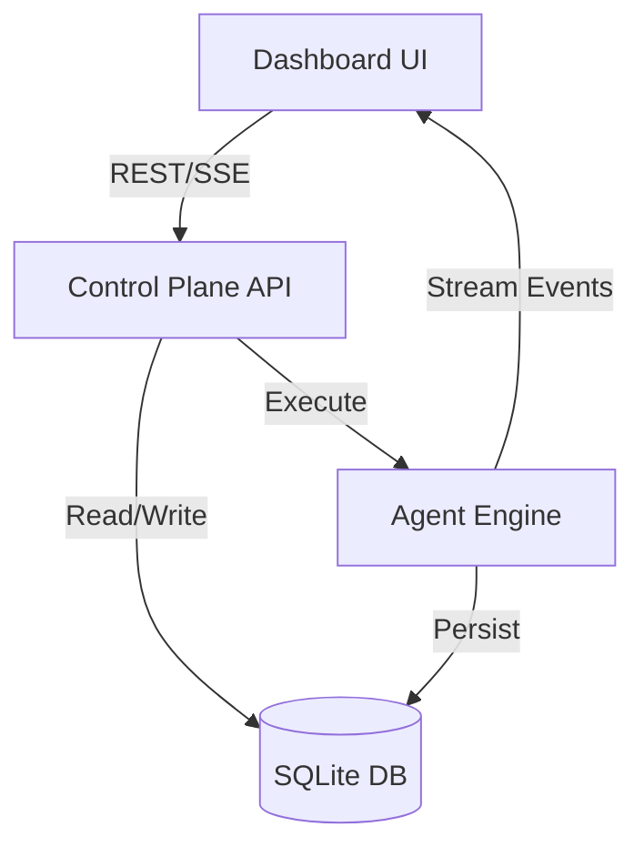

# Harness Engine Dashboard Architecture

The Harness Engine Dashboard is a lightweight, real-time monitoring and control interface designed to visualize Harness agent sessions, event streams, and agent management.

## Philosophy
- **Lean Integration**: Leverages existing Harness Engine Control Plane API (FastAPI) via HTTP and SSE. No duplicated backend logic.
- **Real-time**: Leverages existing `/sessions/{session_id}/stream` SSE endpoint to provide live agent feedback.
- **Modular**: Frontend agnostic (React, Vue, or Vanilla JS), interacting solely with REST/SSE endpoints.

## High-Level Components

### 1. Harness Engine Backend (Existing)
- **API Gateway**: Provides REST endpoints (`/sessions`, `/agents`, `/cron`) and SSE (`/stream`).
- **Data Layer**: SQLite (`memory.db`) for persistent state and run receipts.
- **Webhook Dispatcher**: Triggers push notifications to the dashboard on session lifecycle events.

### 2. Dashboard Frontend (Proposed)
- **Session Manager**: Polls `GET /sessions` to list and filter runs.
- **Event Orchestrator**: Consumes `GET /sessions/{session_id}/stream` (SSE) into a live console.
- **Agent Interceptor**: Interfaces with `POST /sessions/{session_id}/interrupt` to provide mid-task steering.

## Data Flow
1. **User Goal Submission**: Frontend POSTs to `/sessions`.
2. **Session Execution**: Harness Engine executes agent loop, updating SQLite state.
3. **Live Streaming**: Frontend subscribes to `/sessions/{session_id}/stream` for real-time `{"type": "message/tool_call/final_receipt"}` event updates.
4. **Interruption**: Frontend posts to `/sessions/{session_id}/interrupt` to inject user feedback into the active generator loop.

## Integration Diagram

## Implementation Plan
- **Frontend Scaffolding**: Minimal React/HTML application.
- **Control Interface**: Implement the session management list view.
- **Event Feed**: Implement the SSE event consumer.
- **Steering Control**: Add the interruption/agent-steering capability.
