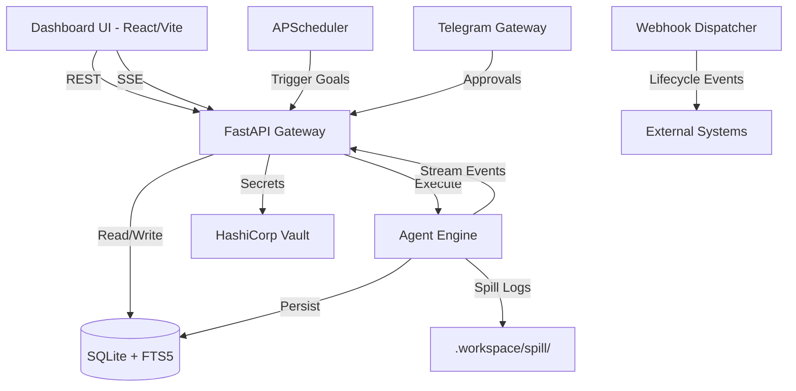

# Harness Engine Dashboard — Architecture & Implementation Plan

**Context:** The Harness Engine (per `harness-engine-implementation-plan.md`) is a general-purpose agentic execution runtime. This document specifies a dashboard modeled on Hermes Agent's official web dashboard — same page structure, same interaction patterns, same polish — but built entirely on the Harness Engine's own primitives (Goal, Policy, RunReceipt, Verification, Learning, Memory, Orchestration).

---

## Part 1 — Architecture Plan

### 1.1 Hermes dashboard properties worth copying exactly

- **One backend, many pages** — every page is a thin view over a REST API; no page owns logic the API doesn't also expose.
- **Auto-refreshing status page as the landing page** — the first thing you see is a live system overview, not a menu.
- **A live streaming pane wired over WebSocket/SSE** — real-time streaming, not polling, for anything actively running.
- **A scope switcher in the sidebar** — one dashboard instance can manage multiple isolated contexts (domain packs).
- **Auth gate that only engages on non-loopback binds** — zero friction for local use, real auth the moment it's exposed.
- **Config as a form auto-generated from a schema** — new config fields appear in the UI without a dashboard code change.
- **A background-job pattern**: long operations return immediately and stream progress via SSE/WebSocket, never a blocking HTTP request.
- **Theming as a first-class, swappable layer**, not hardcoded styling.

### 1.2 Page-by-page mapping — Hermes → Harness Engine

| Hermes page | What it shows | Harness Engine equivalent | Backed by |
|---|---|---|---|
| **Status** (landing) | Agent version, gateway status, active sessions, recent sessions | **Overview** — Goal throughput, Gateway status, active runs, last 20 RunReceipts | SQLite (`run_receipts`) + API |
| **Chat** | Embedded live TUI over WebSocket | **Live Run** — real-time view of a Goal moving through the pipeline (Context → Agent → Policy → Execution → Verification), streamed via SSE | Existing `/sessions/{id}/stream` SSE endpoint |
| **Config** | Auto-generated form over config fields | **Settings** — model config, domain pack toggles, risk-table editor, memory settings | `config/settings.yaml` + `config/agents.yaml` |
| **API Keys** | `.env` management, redacted, categorized | **Secrets** — read-only status view (set/unset, redacted preview) — **the dashboard never displays or edits raw secret values** | Vault integration (existing `core/secrets.py`) |
| **Sessions** | Browse/search/export/prune agent sessions | **Runs** — browse/search/export/prune `RunReceipt`s, same filter pattern (Goals / Automation / All), same FTS search | SQLite (`sessions` table, FTS5) |
| **Logs** | Filtered, live-tailing log viewer | **Logs** — same filter set (level/component/lines), tailing via SSE | `.workspace/spill/` + SQLite |
| **Analytics** | Token/cost usage over 7/30/90 days | **Analytics** — summary cards, daily chart, per-model breakdown, **plus** policy-decision breakdown (ALLOW/REQUIRE_APPROVAL/DENY) and verification pass-rate over time — genuinely new, Hermes has no equivalent | SQLite aggregation queries |
| **Cron** | Scheduled agent-prompt jobs | **Triggers** — scheduled Goals (cron), same create/pause/resume/trigger-now/delete pattern | Existing APScheduler (`core/background/scheduler.py`) |
| **Profiles** | Isolated instances with own config/skills/sessions | **Domain Packs** — DevOps pack (and future packs) as the isolation boundary; switch which domain pack's tools/skills/policy the dashboard is scoped to | `domains/` directory + `config/agents.yaml` |
| **Skills** | Browse/toggle/install skills + toolsets | **Skills & Tools** — installed Skills (toggle enable), Tools (active/inactive), and a **Learning Queue** view unique to this harness (candidate skills pending approval — Hermes has no equivalent gate) | SQLite (`candidate_skills`) + `domains/*/skills/` |
| **MCP** | Add/enable/test/remove MCP servers | **Tool Registry** — same add/enable/test/remove flow, **plus a required risk-tier field per tool action** (R0–R4) that Hermes has no equivalent of | `domains/devops/policy_table.py` + registry |
| **Webhooks** | Dynamic webhook subscriptions | **Webhooks** — same pattern, feeding the Gateway's trigger normalization | Existing `core/gateway/webhooks.py` |
| **Pairing** | Approve/revoke messaging users | **Approval Gate** — Telegram approval flow's dashboard view: pending REQUIRE_APPROVAL actions and candidate skills, with the same Approve/Deny pattern Hermes uses for user pairing, applied to actions instead | SQLite audit trail + `core/gateway/telegram.py` |
| **Channels** | Per-platform messaging config | **Channels** — per-platform config forms, scoped to actual channels (Telegram now, others later) | Vault secrets + SQLite (enabled flags) |
| **System** | Host stats, curator, gateway control, checkpoints | **System** — engine health, **Curator** status (weekly skill-prune, pause/resume/run-now), **Memory Dreams** (consolidation trigger/view), Gateway control | SQLite + `core/memory/dreamer.py` + `core/memory/curator.py` |
| *(new, no Hermes equivalent)* | — | **Orchestration** — view of in-progress and completed multi-agent workflows: phases, fan-out subagents, adversarial cross-checks, convergence status, resumability | SQLite (`workflow_checkpoints`) via `core/orchestration/` |
| *(new, no Hermes equivalent)* | — | **Verification** — dedicated view of expected-vs-observed results across recent runs, filterable by pass/fail — this is the primitive that fixes the "useful-but-unsafe" gap | SQLite (`run_receipts` → `verification` column) |

### 1.3 Technology stack

| Layer | Hermes's choice | Harness Engine's choice | Why |
|---|---|---|---|
| Frontend framework | React 19 + TypeScript | **Same — React 19 + TypeScript** | Proven, matches shadcn/ui |
| Styling | Tailwind CSS v4 | **Same — Tailwind CSS v4** | Direct reuse |
| Component library | shadcn/ui-style components | **Same — shadcn/ui** | Prebuilt, accessible, themeable |
| Dev server | Vite | **Same — Vite**, proxying `/api` to FastAPI backend | Direct reuse |
| Backend framework | FastAPI (Python) | **FastAPI (Python)** — already implemented | Existing Harness Engine API gateway |
| Backend hosting | Local Uvicorn process | **Uvicorn** — already implemented | Existing infrastructure |
| Frontend hosting | Static SPA served by backend | **Vite build → static files served by Nginx or FastAPI** | Simple, no new infra |
| Primary datastore | SQLite (local file) | **SQLite** — already implemented with FTS5 | Existing `core/memory/store.py` |
| Real-time streaming | WebSocket + PTY | **SSE** — already implemented via `/sessions/{id}/stream` | Existing infrastructure |
| Scheduled jobs | Cron scheduler process | **APScheduler** — already implemented | Existing `core/background/scheduler.py` |
| Secrets | `.env` file | **HashiCorp Vault** — already implemented | Existing `core/secrets.py` |
| Auth (local) | No gate on loopback | **Same — no gate on loopback** | Zero friction for dev |
| Auth (exposed) | HMAC-signed session cookie | **Same pattern** — `scrypt` password hash, HMAC session token | Matches Hermes's homelab pattern |

### 1.4 Auth design

Mirror Hermes's fail-closed design:

- **Loopback (localhost) → no gate** — zero friction for local dev.
- **Non-loopback bind → mandatory auth**:
  1. `POST /api/auth/login` checking `username` + `scrypt(password)` against env-stored credentials.
  2. On success, mint an HMAC-signed session token with 12-hour TTL, set as `HttpOnly; Secure; SameSite=Lax` cookie.
  3. Every `/api/*` route checks the cookie via a FastAPI middleware.
  4. **Fail closed**: if the signing secret isn't configured, the API refuses to serve dashboard routes.

### 1.5 Real-time run streaming

For **Live Run** and **Orchestration** pages:

1. When a Goal starts, the existing `run_agent_generator` in `core/agent_engine.py` yields structured events.
2. The existing `GET /sessions/{session_id}/stream` SSE endpoint broadcasts these events.
3. The dashboard's Live Run page opens an `EventSource` connection and renders events as they arrive — structured JSON events rendered as a timeline.
4. Closing the browser tab drops the SSE connection; the run continues unaffected (runs are triggered independently of the dashboard).

### 1.6 Data flow



### 1.7 Unique features beyond Hermes

1. **Risk & Policy Visualization**: Color-coded tool calls based on R0–R4 risk tier — Hermes has no policy engine.
2. **Token Budget Monitoring**: Real-time gauge for the `token_budget` — Hermes has no budget enforcement.
3. **Learning Queue**: Candidate skills pending human approval before promotion — Hermes has no learning gate.
4. **Verification Page**: Dedicated expected-vs-observed view — Hermes has no verification primitive.
5. **Orchestration Page**: Multi-agent workflow visualization with phase tracking — Hermes has no multi-agent support.
6. **Memory Dream UI**: Automated memory consolidation visualization — Hermes has no memory system.
7. **Policy Analytics**: ALLOW/REQUIRE_APPROVAL/DENY breakdown over time — Hermes has no policy metrics.
8. **Output Spill Viewer**: Browse truncated outputs with links to full spill files — Hermes has no output management.

---

## Part 2 — Implementation Plan

### Phase D0 — Dashboard Backend Extensions

Extend the existing FastAPI gateway (`core/gateway/api.py`) with new endpoints required by the dashboard pages. No new backend framework — reuse what exists.

**D0.1 — New API endpoints:**
- `GET /api/status` — Overview page data (active runs, recent receipts, gateway health)
- `GET /api/runs` — Paginated, FTS-searchable run receipts (wraps existing session queries)
- `GET /api/runs/{id}` — Single receipt detail
- `GET /api/analytics/usage` — Token/cost aggregation over 7/30/90 days
- `GET /api/analytics/policy` — Policy decision breakdown (new, no Hermes equivalent)
- `GET /api/config/schema` — Auto-generated config schema from `settings.yaml` + `agents.yaml`
- `PUT /api/config` — Update config values
- `GET /api/secrets/status` — Redacted secret status (set/unset only, never values)
- `GET /api/skills` — List skills with enabled/disabled state
- `PUT /api/skills/{id}/toggle` — Enable/disable a skill
- `GET /api/candidate-skills` — Learning Queue (pending candidate skills)
- `POST /api/candidate-skills/{id}/decide` — Approve/reject candidate skill
- `GET /api/tools` — Tool Registry with risk tiers
- `GET /api/approvals` — Pending approval queue
- `POST /api/approvals/{id}/decide` — Approve/deny an action
- `GET /api/orchestration/workflows` — Workflow list
- `GET /api/orchestration/workflows/{id}` — Workflow phase detail
- `GET /api/verification/recent` — Recent verification results, filterable by pass/fail
- `GET /api/system/health` — Engine health status
- `POST /api/system/curator/run` — Trigger curator run-now
- `GET /api/logs` — Filtered log viewer (reads from `.workspace/spill/`)

**D0.2 — Auth middleware** (only active when `DASHBOARD_AUTH_SECRET` is set):
- `POST /api/auth/login` — Issue session cookie
- FastAPI dependency that checks cookie on all `/api/*` routes
- Fail-closed: if secret not set and non-loopback bind, refuse `/api/*`

**D0.3 — DB schema extensions** (new tables in `core/memory/store.py` migration):
- `approval_queue` — pending/decided actions for the Approval Gate page
- `analytics_daily` — pre-aggregated daily token/policy stats for fast dashboard queries

Acceptance: all new endpoints return valid JSON against the existing SQLite database.

### Phase D1 — Frontend Scaffold (React/Vite/Tailwind/shadcn)

**D1.1 — Initialize proper frontend:**
```bash
cd frontend
npm install -D tailwindcss@4 @tailwindcss/vite
npx shadcn@latest init
```

**D1.2 — Vite proxy config** — proxy `/api` to `localhost:8000` (FastAPI backend).

**D1.3 — App shell:**
- Sidebar with navigation links for all pages from Section 1.2
- Domain Pack switcher dropdown in sidebar header
- Dark/light theme toggle (Tailwind `dark:` classes)
- Login page (shown when 401 received)

Acceptance: `npm run dev` renders the app shell with sidebar navigation, all links present.

### Phase D2 — Overview (Landing Page)

- Auto-refreshing status cards: active runs, success/failure counts, gateway health
- Last 20 RunReceipts in a compact table (goal, status, duration, model)
- Token usage summary card

Acceptance: page renders real data from `GET /api/status`, auto-refreshes every 10s.

### Phase D3 — Live Run Page

- Session selector (dropdown of active/recent sessions)
- SSE event consumer connected to `GET /sessions/{session_id}/stream`
- Timeline renderer: each event as a card (message, tool_call, tool_result, interruption_received, final_receipt)
- Risk tier badge on tool_call events (color-coded R0–R4)
- Token budget gauge (progress bar, updated from event data)
- Interrupt input form → `POST /sessions/{session_id}/interrupt`

Acceptance: opening the page while a session is running shows events appearing in real time; interrupt form successfully injects a message into the running agent loop.

### Phase D4 — Runs Page

- Paginated table of all RunReceipts
- FTS search bar (queries `run_receipts_fts`)
- Filter tabs: All / Success / Failure
- Click-to-expand receipt detail (actions, verification, candidate_skill)
- Export button (download receipt as JSON)

Acceptance: searching for a keyword returns matching runs; filtering by status works; export downloads valid JSON.

### Phase D5 — Settings, Secrets & Channels Pages

- **Settings**: auto-generated form from `GET /api/config/schema`, submit via `PUT /api/config`
- **Secrets**: read-only table showing secret name, status (set/unset), redacted preview — no edit capability
- **Channels**: Telegram enabled/disabled toggle, bot status indicator

Acceptance: settings form renders all config fields; secrets page never shows raw values; channel toggle persists state.

### Phase D6 — Skills, Tools & Learning Queue Pages

- **Skills & Tools**: table of installed skills/tools with enable/disable toggles
- **Tool Registry**: table with risk-tier column (R0–R4 dropdown per tool action) — unique to Harness
- **Learning Queue**: table of candidate skills pending approval, with Approve/Reject buttons — unique to Harness

Acceptance: toggling a skill persists; approving a candidate skill promotes it; risk tier changes persist.

### Phase D7 — Analytics Page

- Summary cards: total tokens, total cost, total runs (7/30/90 day selector)
- Daily usage chart (bar chart, tokens per day)
- Per-model breakdown table
- **Policy decision breakdown** (pie chart: ALLOW/REQUIRE_APPROVAL/DENY) — new, no Hermes equivalent
- **Verification pass-rate over time** (line chart) — new, no Hermes equivalent

Acceptance: charts render with real aggregated data; time range selector updates all charts.

### Phase D8 — Approval Gate, Triggers & Webhooks Pages

- **Approval Gate**: pending queue with Approve/Deny buttons, audit trail of past decisions — mirrors Telegram approval but from the dashboard
- **Triggers**: cron job table with create/pause/resume/trigger-now/delete actions
- **Webhooks**: subscription table with add/remove/test actions

Acceptance: approving from dashboard unblocks the same action Telegram would; cron CRUD works; webhook test fires successfully.

### Phase D9 — Orchestration & Verification Pages (Harness-unique, no Hermes equivalent)

- **Orchestration**: workflow list, click into phase-by-phase detail, subagent status, convergence indicator, resume button for interrupted workflows
- **Verification**: table of recent run verifications (expected vs observed), filterable by pass/fail, drill-down into individual check details

Acceptance: orchestration page shows real workflow data with correct phase status; verification page filters work correctly.

### Phase D10 — System Page

- Engine health indicators (SQLite connection, Vault status, scheduler status)
- **Curator**: status display, pause/resume/run-now buttons
- **Memory Dreams**: trigger consolidation button, display consolidated themes
- **Checkpoints**: browse rollback points and workflow checkpoints
- Log viewer with level/component filter and tail mode

Acceptance: curator run-now triggers and completes; memory dream returns themes; log viewer tails new entries.

### Phase D11 — Dashboard Hardening & Deployment

- Auth middleware tested: loopback bypass, non-loopback enforcement, fail-closed on missing secret
- Production build: `npm run build` outputs to `frontend/dist/`
- Production Dockerfile (multi-stage: build frontend, serve via Nginx with API proxy)
- `docker-compose.yml` update: add dashboard service alongside existing engine
- CORS configuration on FastAPI for dashboard origin

Acceptance: `docker compose up` starts both backend and dashboard; production URL loads login page; all pages render against real data; no secret values visible in frontend bundle (`grep` confirms zero matches).

### Phase D12 — Parity check

Walk the Section 1.2 table page by page and confirm: does each page do everything the corresponding Hermes page does, translated to Harness Engine primitives? Pay particular attention to the four pages with **no Hermes equivalent** (Learning Queue, Orchestration, Verification, Policy Analytics) — these are the pages that make this dashboard more than a clone.

---

## Final acceptance for the dashboard

- Every page in Section 1.2 is live, backed by real data, not mocked.
- The Live Run page shows a real Goal's progress in real time via SSE.
- The Approval Gate page and Telegram both correctly gate and unblock the same underlying REQUIRE_APPROVAL action.
- The Orchestration page correctly shows a real multi-agent workflow's phase-by-phase progress.
- Auth is confirmed fail-closed: removing the auth secret causes the API to refuse `/api/*` traffic.
- No secret value is ever visible in the frontend bundle.
