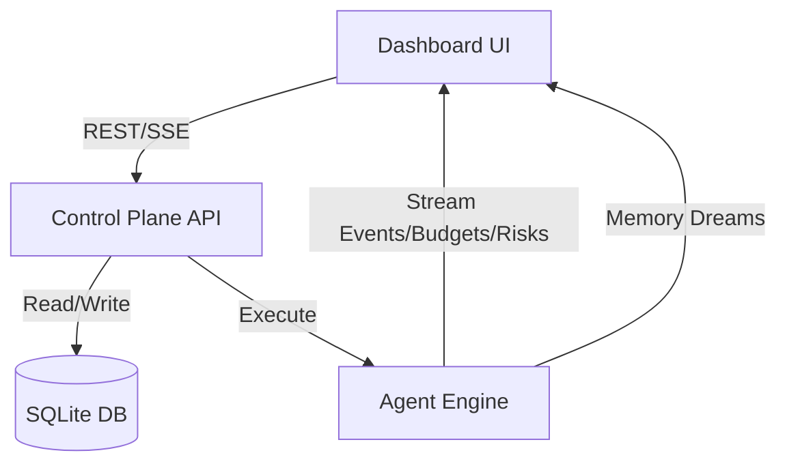

# Harness Engine Dashboard Architecture

The Harness Engine Dashboard is a real-time monitoring and control interface designed to visualize Harness agent sessions, event streams, and agent/policy management.

## Philosophy
- **Lean Integration**: Leverages existing Harness Engine Control Plane API (FastAPI) via HTTP and SSE.
- **Deep Visibility**: Beyond simple logging, visualizes engine-specific hardening (Token Budgets, Security Tiers).
- **Control**: Immediate interruption and state steering.

## Architecture vs Hermes-like Patterns
| Feature | Typical "Hermes" | Harness Engine (Proposed) | Value Add |
| :--- | :--- | :--- | :--- |
| **Observation** | Log stream | SSE Events + Security Tiering | Visibility into Risk (R0-R4) |
| **Budgeting** | None | Real-time Token Budget/Turn Tracking | Prevents unexpected overages |
| **Memory** | None | Memory Dream Visualization | Understands what the agent learned |
| **Controls** | Simple Interrupt | Stateful Steering + Tool Override | Fine-grained agent control |

## Data Flow

## Unique Features & Enhancements
1.  **Risk & Policy Visualization**: Color-coded tool calls based on R0–R4 risk tier.
2.  **Token Budget Monitoring**: Real-time gauge for the `token_budget` (currently in `agent_engine.py`).
3.  **Memory Dream UI**: Dedicated panel visualizing recent `run_memory_consolidation()` outputs.
4.  **Run Receipt Inspector**: Deep inspection of the `RunReceipt`, including `candidate_skill` if triggered.

## Implementation Plan
1.  **Frontend Shell**: React scaffolding.
2.  **Session/Agent View**: List view with policy-tier filters.
3.  **Live Console**: Stream events + token budget gauge.
4.  **Memory & Policy Panels**: Dedicated views for Memory Dreams and Risk Tier inspection.
5.  **Steering Control**: Interruption control.
